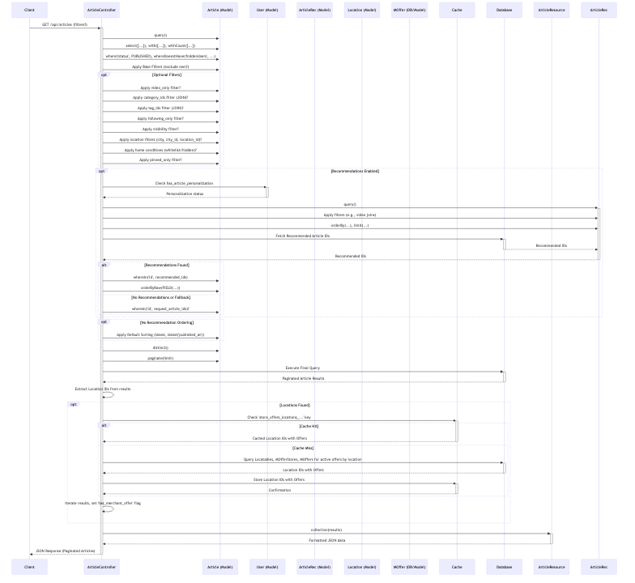

# Article Module

The Article module is a core component of the FunHub Mobile Backend, providing functionality for creating, retrieving, updating, and managing articles. This module enables users to share content, tag other users, attach media, and associate locations with their articles.

## User Stories

| As a | I want to | Acceptance Criteria |
|------|-----------|---------------------|
| User | Create and publish articles | - I can create articles with text, images, or videos - I can add a title, body, and optional excerpt - I can set the article status (draft or published) - I can tag other users in my articles - I can attach a location to my article - I can categorize my article - I can add tags to my article - I can set the visibility of my article (public or private) |
| User | View articles from other users | - I can see articles in my feed - I can filter articles by category, tags, or location - I can see articles from users I follow - I can view articles on a map based on location - I can search for articles by keywords |
| User | Interact with articles | - I can bookmark articles for later viewing - I can hide articles I'm not interested in - I can report inappropriate articles - I can view who was tagged in an article |
| User | Manage my articles | - I can update my articles - I can delete my articles - I can change the visibility of my articles - I can see all articles I've created |
| User | Upload media for articles | - I can upload images for my articles - I can upload videos for my articles - I can see the upload progress for videos |

## Key Methods and Logic Flow

### `index()`
The main method for retrieving articles with complex filtering and sorting capabilities.

**Implementation Details:**
- Constructs a sophisticated query to fetch published articles with optimized performance
- Uses eager loading to preload related data (users, categories, media, tags, locations, interactions)
- Implements multiple filtering mechanisms:
  - Category filtering using optimized join operations
  - Video-only filtering to show only articles with videos
  - Following-only filtering to show articles from followed users
  - Location-based filtering (by city, coordinates, radius)
  - Store-specific filtering for articles related to specific stores
- Handles personalized article recommendations:
  - Uses cached recommendations when available
  - Builds new recommendations when needed based on user preferences
  - Applies ranking algorithms to prioritize relevant content
- Applies performance optimizations:
  - Selective field retrieval to minimize data transfer
  - Join operations instead of whereHas for better query performance
  - Pagination with configurable limits

### `store()`
Handles the creation of new articles with associated relationships.

**Implementation Details:**
- Validates input data for required and optional fields
- Generates a unique slug for the article based on title
- Sets visibility based on user's profile privacy settings
- Creates the article record with basic information
- Processes and attaches media:
  - Moves images from temporary user uploads to article gallery
  - Processes videos and dispatches background processing jobs
- Attaches categories and tags to the article
- Processes location data using createOrAttachLocation method
- Tags users and sends notifications
- Triggers article indexing for search using Scout/Algolia

### `createOrAttachLocation()`
A critical method that handles location processing for articles, ensuring data consistency and preventing duplication.

**Implementation Details:**
- First attempts to find an existing location by Google Place ID
- If not found by Google ID, searches by coordinates with a small radius tolerance
- Uses similarity matching for location names to prevent duplication
- Handles special cases like mall outlets that share coordinates but have different names
- If location exists, attaches it to the article
- If location doesn't exist, creates a new location record with:
  - Name, address, coordinates, Google Place ID
  - City, state, and country information (creating new records if needed)
  - Phone, website, and other metadata
- Processes user ratings for locations:
  - Creates or updates the user's rating for the location
  - Recalculates the location's average rating
  - Triggers the RatedLocation event for further processing
- Returns the location object for attachment to the article

### `update()`
Manages the updating of existing articles with proper authorization checks.

**Implementation Details:**
- Verifies the user is the owner of the article before allowing updates
- Validates input data for all fields
- Updates basic article information (title, body, status, etc.)
- Regenerates slug if the title has changed
- Updates visibility settings based on user input or profile privacy
- Processes media changes:
  - Handles image additions and removals
  - Updates video attachments and triggers processing if needed
- Updates category and tag associations
- Updates location information using createOrAttachLocation
- Updates tagged users and sends notifications to newly tagged users
- Triggers article reindexing for search to update searchable content

### `show()`
Retrieves a specific article by ID with all related information.

**Implementation Details:**
- Finds the article by ID with eager loading of relationships
- Checks visibility permissions based on user relationship to the article owner
- Increments view count and records view interaction
- Returns article with all related data including:
  - User information (with profile details)
  - Media (images and videos with processing status)
  - Categories and tags
  - Location information
  - Interaction counts (views, comments, likes)

### `destroy()`
Handles the deletion of articles with proper authorization checks.

**Implementation Details:**
- Verifies the user is the owner of the article
- Performs soft deletion to maintain referential integrity
- Removes the article from search indexes
- Detaches relationships (categories, tags, etc.)
- Returns success response with confirmation message

### `getArticlesNearby()`
Specialized method for location-based article discovery.

**Implementation Details:**
- Requires latitude and longitude parameters
- Uses spatial queries to find articles within a specified radius
- Calculates distance and sorts results by proximity
- Applies additional filters (categories, tags, video-only)
- Optimizes query performance with selective loading and pagination
- Returns articles with distance information included

### `articlesSearch()`
Provides full-text search capabilities for articles.

**Implementation Details:**
- Uses Scout/Algolia for efficient full-text search
- Supports keyword searching across article title and content
- Applies filters to search results (categories, tags, etc.)
- Handles suggestion-based searches for partial matches
- Returns paginated results with all relationships loaded
- Includes relevance scoring in the results

### `postGalleryUpload()` and `postVideoUpload()`
Handle media uploads for articles with proper validation and processing.

**Implementation Details:**
- Validate file types, sizes, and formats
- Process uploads through the media library
- For videos, dispatch background processing jobs
- Store media in user's temporary collection until attached to an article
- Return media information for frontend display and attachment

## Security Considerations
- Authorization checks ensure only article owners can update/delete
- Users with private profiles have articles set to private by default
- Users can only tag followers in articles
- Content filtering prevents viewing articles from blocked users
- Location data is only shared when explicitly provided
- Media uploads are validated for type and size
- Input data is sanitized and validated before processing

## Performance Considerations
- Eager loading relationships to prevent N+1 query issues
- Selective field retrieval to minimize data transfer
- Join operations instead of whereHas for better query performance
- Caching of recommendations and frequently accessed data
- Background processing for video handling
- Pagination to limit result sets
- Indexing of articles for efficient search operations
