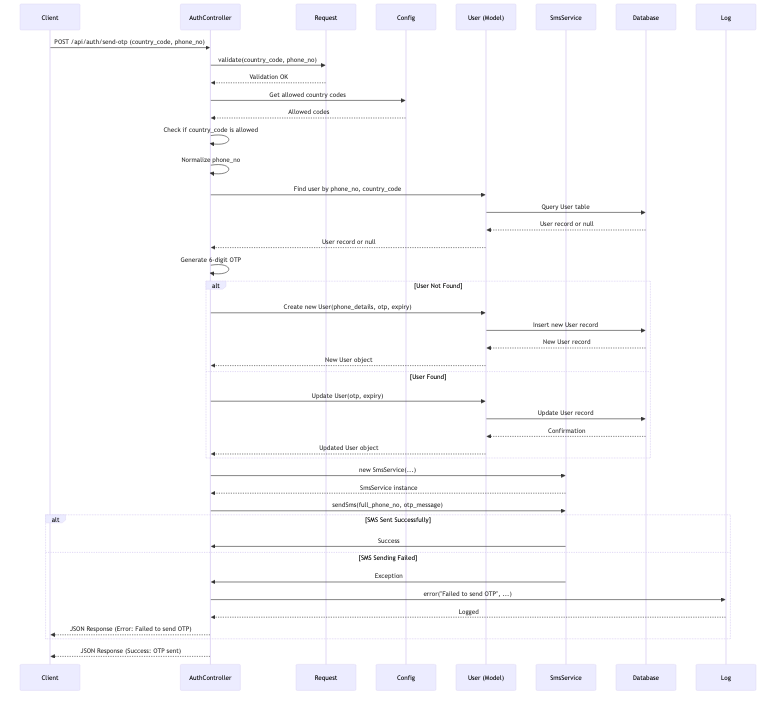

# Authentication Module

The Authentication module provides functionality for user registration, login, and account management in the FunHub Mobile Backend.

## User Stories

| As a | I want to | Acceptance Criteria |
|------|----------|---------------------|
| New User | Register for a new account using my phone number | - Users can register with a valid phone number - OTP verification is required to complete registration |
| New User | Verify my identity through OTP | - System sends OTP to the provided phone number - Users can enter OTP to verify their identity - OTP expires after a set time period |
| New User | Complete my profile with personal information | - Users can provide name, email, and password - Users can upload a profile picture - Email verification is available but not mandatory |
| New User | Link my social media accounts for easier login | - Users can connect Google, Facebook, or Apple accounts - Social login information is securely stored |
| Registered User | Log in using my phone number and password | - System validates credentials - Successful login returns user information and authentication token |
| Registered User | Log in using OTP for passwordless authentication | - System sends OTP to the registered phone number - Users can enter OTP to log in without password |
| Registered User | Log in using my social media accounts | - Users can authenticate via Google, Facebook, or Apple - System links social accounts to existing user profile |
| Registered User | Reset my password if I forget it | - Users can request password reset via phone number - System sends OTP for verification before password reset |
| Registered User | Log out from my account | - Users can securely log out - Authentication token is invalidated |
| Registered User | Verify my email address | - System sends verification email - Users can verify email through a secure link or code |

### Account Management
- Users can verify their email address
- Users can reset their password using OTP
- Users can log out and invalidate their authentication token

## Logic Flow

### Phone Registration and OTP Verification
1. **Check Phone Number Exists (`checkPhoneNoExists`)**
   - Validates if a phone number is already registered
   - Returns status indicating if the number is registered and if the user has a password set

2. **Send OTP (`sendOtp`)**

   - Validates country code and phone number
   - Generates a 6-digit OTP
   - If user doesn't exist, creates a new user record with the phone number and OTP
   - If user exists, updates the existing record with new OTP
   - Sends OTP via SMS with 1-minute expiration time
   - Returns success message if OTP is sent successfully

3. **Verify OTP (`postVerifyOtp`)**
   - Validates country code, phone number, and OTP
   - Checks if OTP matches and is not expired
   - If valid, marks OTP as verified and nullifies OTP fields
   - Creates authentication token for the user
   - Returns user information and token

4. **Register with OTP (`registerWithOtp`)**
   - Validates country code, phone number, OTP, name, and password
   - Verifies OTP is valid
   - Updates user record with name and password
   - Creates authentication token
   - Returns user information and token

### Social Login
1. **Facebook Login (`facebookLogin`)**
   - Validates Facebook access token
   - Fetches user information from Facebook
   - If user doesn't exist, creates new user with Facebook information
   - Creates authentication token
   - Returns user information and token

2. **Google Login (`googleLogin`)**
   - Validates Google access token
   - Fetches user information from Google
   - If user doesn't exist, creates new user with Google information
   - Creates authentication token
   - Returns user information and token

3. **Firebase Social Login (`socialLogin`)**
   - Validates Firebase authentication token
   - Determines provider (Google, Facebook, or Apple)
   - Fetches user information from Firebase
   - If user doesn't exist, creates new user with provider information
   - Creates authentication token
   - Returns user information and token

### Password Management
1. **Reset Password with OTP**
   - Two-step process:
     - Step 1 (`postResetPasswordSendOtp`): Sends OTP to user's phone
     - Step 2 (`postResetPasswordWithOtp`): Verifies OTP and updates password

### Profile Completion
1. **Complete Profile (`postCompleteProfile`)**
   - Updates user profile with name, email, and password
   - Sends email verification if email is provided
   - Returns success message

### Email Verification
1. **Send Verification Email (`postSendVerificationEmail`)**
   - Sends verification email with token
   - Returns success message

2. **Verify Email (`postVerifyEmail`)**
   - Validates verification token
   - Updates user's email verification status
   - Returns success message

### Logout
1. **Logout (`logout`)**
   - Invalidates current authentication token
   - Returns success message

## Security Considerations
- OTP expires after 1 minute for security
- Passwords are hashed using Laravel's Hash facade
- Authentication is handled through Laravel Sanctum tokens
- Social login verification is handled through respective provider APIs and Firebase
- Phone numbers are normalized before processing (removing leading zeros and country codes)
