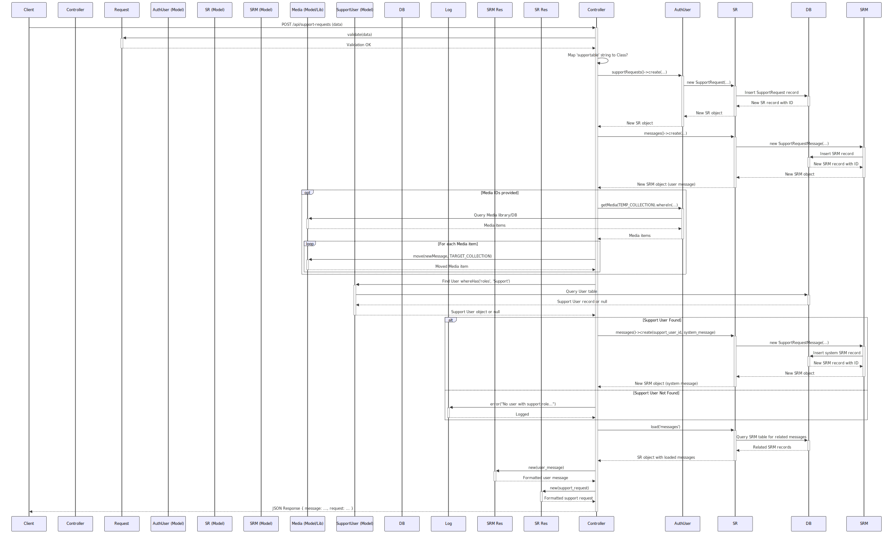

# Help Center Module

The Help Center module is a core component of the FunHub Mobile Backend, providing functionality for users to raise support requests, communicate with support staff, and track the status of their inquiries. This module enables efficient handling of user issues, bug reports, feature requests, and other support-related communications.

## User Stories

| As a | I want to | Acceptance Criteria |
|------|-----------|---------------------|
| User | Raise a support request | - I can create a support request with a title and message<br>- I can select a category for my request<br>- I can attach images to illustrate my issue<br>- I can link my request to specific content (e.g., articles)<br>- I receive confirmation when my request is submitted |
| User | View my support requests | - I can see a list of all my support requests<br>- I can filter requests by status (pending, in progress, closed, etc.)<br>- I can filter requests by category<br>- I can search for specific requests by title<br>- I can see the status of each request |
| User | Communicate with support staff | - I can add messages to an existing support request<br>- I can attach images to my messages<br>- I can see all messages in a conversation thread<br>- I receive notifications when support staff responds |
| User | Resolve my support request | - I can mark a request as resolved when my issue is fixed<br>- I can reopen a closed request if needed<br>- I can see when a request was closed |
| Administrator | Manage support requests | - I can view all support requests in the admin panel<br>- I can filter requests by status, category, and requestor<br>- I can assign requests to specific staff members<br>- I can change the status of requests<br>- I can add internal remarks visible only to staff |
| Administrator | Respond to support requests | - I can reply to user messages<br>- I can view attached images<br>- I can see the full conversation history<br>- I can mark requests as requiring more information |

## Key Methods and Logic Flow

### `index()`
The main method for retrieving a user's support requests with filtering capabilities.

**Implementation Details:**
- Retrieves the authenticated user's support requests with associated messages
- Orders requests by creation date in descending order (newest first)
- Implements multiple filtering mechanisms:
  - Status filtering (pending, in progress, closed, etc.)
  - Category filtering
  - Text search on request titles
- Paginates results for efficient data transfer and display

```php
public function index(Request $request)
{
    // get all my own support requests
    $query = $request->user()->supportRequests()
        ->with('messages')
        ->orderBy('created_at', 'desc');

    if ($request->has('query')) {
        $query->where('title', 'like', '%' . $request->query . '%');
    }

    if ($request->has('status')) {
        // check whether status number is valid
        if (!in_array($request->status, array_keys(SupportRequest::STATUS))) {
            return response()->json([
                'message' => __('messages.error.support_request_controller.Invalid_status')
            ], 422);
        }
        $query->where('status', $request->status);
    }

    if ($request->has('category_ids')) {
        $query->whereIn('category_id', $request->category_ids);
    }

    $results = $query->paginate(
        ($request->has('limit') ? $request->limit : config('app.paginate_per_page'))
    );

    return SupportRequestResource::collection($results);
}
```

### `postRaiseSupportRequest()`
Creates a new support request with initial message and optional attachments.



**Implementation Details:**
- Validates required input fields (category, title, message)
- Supports linking the request to specific content (e.g., articles)
- Creates a new support request record with pending status
- Creates the initial message from the user
- Handles attachment of media files to the message
- Creates an automatic system response when a support user is available
- Returns the created request and message data

```php
public function postRaiseSupportRequest(Request $request)
{
    $this->validate($request, [
        'supportable' => 'nullable|string',
        'supportable_id' => 'required_with:supportable|integer',
        'category_id' => 'required|exists:support_requests_categories,id',
        'title' => 'required|string',
        'message' => 'required|string',
        'media_ids' => 'nullable|array',
    ]);

    if ($request->supportable == 'article') {
        $request->merge(['supportable' => Article::class]);
    }

    // create new support request
    $supportRequest = $request->user()->supportRequests()->create([
        'category_id' => $request->category_id,
        'supportable_type' => $request->supportable,
        'supportable_id' => $request->supportable_id,
        'title' => $request->title,
        'status' => SupportRequest::STATUS_PENDING
    ]);

    // create a new message attach to this
    $message = $supportRequest->messages()->create([
        'user_id' => $request->user()->id,
        'message' => $request->message
    ]);

    // move media to attached to message
    if ($request->has('media_ids')) {
        $userUploads = auth()->user()->getMedia(SupportRequestMessage::MEDIA_COLLECTION_NAME)
            ->whereIn('id', $request->media_ids);
        $userUploads->each(function ($media) use ($message) {
            $media->move($message, SupportRequestMessage::MEDIA_COLLECTION_NAME);
        });
    }

    // create a default system message for the support request if there is user with 'Support' role
    try {
        $supportUser = User::whereHas('roles', function ($query) {
            $query->where('name', 'Support');
        })->firstOrFail();

        $systemMessage = $supportRequest->messages()->create([
            'user_id' => $supportUser->id,
            'support_request_id' =>  $supportRequest->id,
            'message' => "你好，我们已收到你的反馈。\n客服服务时间：星期一至星期五 11.00am - 7.00pm\n我们会在24小时内尽快回复你。\n若遇到周末和公假，回复时间会比较长。还请理解，非常感谢"
        ]);
    } catch (\Exception $e) {
        // Catch error if no user with the role 'Support' is found
        Log::error('No user with support role is found');
    }

    $supportRequest->load('messages');

    return [
        'message' => new SupportRequestMessageResource($message),
        'request' => new SupportRequestResource($supportRequest)
    ];
}
```

### `postReplyToSupportRequest()`
Adds a new message to an existing support request.

**Implementation Details:**
- Validates the message content
- Verifies that the user owns the support request
- Creates a new message in the support request thread
- Handles attachment of media files to the message
- Returns the updated support request with all messages

```php
public function postReplyToSupportRequest(SupportRequest $supportRequest, Request $request)
{
    $this->validate($request, [
        'message' => 'required|string',
        'media_ids' => 'nullable|array',
    ]);

    // check if supportRequest requestor is same as current user
    if ($supportRequest->requestor_id != $request->user()->id) {
        return response()->json([
            'message' => __('messages.error.support_request_controller.You_are_not_allowed_to_reply_to_this_support_request')
        ], 403);
    }

    // create a new message attach to this
    $message = $supportRequest->messages()->create([
        'user_id' => $request->user()->id,
        'message' => $request->message
    ]);

    // move media to attached to message
    if ($request->has('media_ids')) {
        $userUploads = auth()->user()->getMedia(SupportRequestMessage::MEDIA_COLLECTION_NAME)
            ->whereIn('id', $request->media_ids);
        $userUploads->each(function ($media) use ($message) {
            $media->move($message, SupportRequestMessage::MEDIA_COLLECTION_NAME);
        });
    }

    $supportRequest->load('messages');
    return response()->json([
        'message' => __('messages.error.support_request_controller.New_support_request_message_created'),
        'request' => new SupportRequestResource($supportRequest)
    ]);
}
```

### `postResolveSupportRequest()`
Allows users to mark their support request as resolved.

**Implementation Details:**
- Verifies that the user owns the support request
- Updates the support request status to closed
- Returns a success message

```php
public function postResolveSupportRequest(SupportRequest $supportRequest)
{
    // check if supportRequest requestor is same as current user
    if ($supportRequest->requestor_id != auth()->user()->id) {
        return response()->json([
            'message' => __('messages.error.support_request_controller.You_are_not_allowed_to_reply_to_this_support_request')
        ], 403);
    }

    $supportRequest->update([
        'status' => SupportRequest::STATUS_CLOSED
    ]);

    return response()->json([
        'message' => __('messages.success.support_request_controller.Support_request_resolved_and_closed')
    ]);
}
```

### `postAttachmentsUpload()`
Handles the upload of images for support request messages.

**Implementation Details:**
- Validates that the uploaded files are valid images
- Supports both single and multiple image uploads
- Stores images using the Spatie Media Library
- Returns metadata about the uploaded images (ID, URL, size, type)

```php
public function postAttachmentsUpload(Request $request)
{
    $this->validate($request, [
        'images' => 'required',
        'images.*' => 'image|mimes:jpg,jpeg,png,gif,heic'
    ]);

    $user = auth()->user();
    $images = [];
    // if request images is not array wrap it in array
    if (!is_array($request->images)) {
        // upload via spatie medialibrary
        // single image
        $uploaded = $user->addMedia($request->images)
            ->toMediaCollection(
                SupportRequestMessage::MEDIA_COLLECTION_NAME,
                (config('filesystems.default') == 's3' ? 's3_public' : config('filesystems.default')),
            );
        return response()->json([
            'uploaded' => [
                [
                    'id' => $uploaded->id,
                    'name' => $uploaded->file_name,
                    'url' => $uploaded->getUrl(),
                    'size' => $uploaded->size,
                    'type' => $uploaded->mime_type,
                ],
            ],
        ]);
    } else {
        // multiple images
        $uploaded = collect($request->images)->map(function ($image) use ($user) {
            return $user->addMedia($image)
                ->toMediaCollection(
                    SupportRequestMessage::MEDIA_COLLECTION_NAME,
                    (config('filesystems.default') == 's3' ? 's3_public' : config('filesystems.default')),
                );
        });
        $uploaded->each(function ($image) use (&$images) {
            $images[] = [
                'id' => $image->id,
                'name' => $image->file_name,
                'url' => $image->getUrl(),
                'size' => $image->size,
                'type' => $image->mime_type,
            ];
        });
        return response()->json([
            'uploaded' => $images,
        ]);
    }
}
```

## Admin Management Interface

The Help Center module includes a comprehensive admin interface built with Filament, allowing support staff to efficiently manage and respond to user requests.

### Key Admin Features

1. **Support Request Dashboard**
   - Lists all support requests with filtering and sorting options
   - Shows request status with color-coded badges
   - Displays key information (title, category, requestor, assignee)
   - Shows unresolved request count in the navigation badge

2. **Request Assignment**
   - Allows assigning requests to specific staff members
   - Restricts assignment to users with appropriate roles (super_admin, moderator, staff)
   - Enables filtering requests by assignee

3. **Status Management**
   - Provides options to update request status:
     - Pending (0)
     - In Progress (1)
     - Pending Info (2)
     - Closed (3)
     - Reopened (4)
     - Invalid (5)

4. **Message Management**
   - Displays the full conversation history
   - Shows message timestamps and sender information
   - Renders attached images with clickable links
   - Allows staff to add new messages directly from the admin interface

### Admin Reply Implementation

The MessagesRelationManager enables admins to reply to support requests:

```php
class MessagesRelationManager extends RelationManager
{
    protected static string $relationship = 'messages';
    protected static ?string $recordTitleAttribute = 'message';

    public static function form(Form $form): Form
    {
        return $form
            ->schema([
                Hidden::make('user_id')
                    ->default(fn () => auth()->id()),

                Forms\Components\TextInput::make('message')
                    ->required()
                    ->maxLength(255),
            ]);
    }

    public static function table(Table $table): Table
    {
        return $table
            ->columns([
                TextColumn::make('created_at')
                    ->label('Sent At')
                    ->sortable()
                    ->searchable(),
                TextColumn::make('user.name')
                    ->label('User')
                    ->sortable()
                    ->searchable(),
                TextColumn::make('message')
                    ->label('Message')
                    ->getStateUsing(function (Model $record){
                        $mediaLinks = $record->getMedia('support_uploads')->map(function ($media) {
                            return '<a href="' . $media->getUrl() . '" target="_blank" style="color: blue; text-decoration: underline;">' . $media->file_name . '</a>';
                        })->filter()->implode('<br>');
                        return new HtmlString($record->message . ($mediaLinks ? '<br>' . $mediaLinks : ''));
                    })
                    ->sortable()
                    ->searchable(),
            ])
            ->headerActions([
                Tables\Actions\CreateAction::make(),
            ]);
    }
}
```

## Support Request Categories

The system provides predefined categories for support requests to help organize and prioritize user inquiries:

| Type | Description |
|------|-------------|
| complain | User complaints about service or experience |
| bug | Reports of technical issues or malfunctions |
| feature_request | Suggestions for new features or improvements |
| information_update | Requests to update or correct information |
| others | General inquiries that don't fit other categories |

Categories can be managed by administrators and have a published status to control which categories are available to users.


## Security Considerations

1. **Ownership Verification**: All endpoints verify that users can only access and modify their own support requests
   ```php
   if ($supportRequest->requestor_id != $request->user()->id) {
       return response()->json([
           'message' => __('messages.error.support_request_controller.You_are_not_allowed_to_reply_to_this_support_request')
       ], 403);
   }
   ```

2. **Role-Based Access Control**: Admin interface restricts access based on user roles
   ```php
   $query->whereHas('roles', function ($query) {
       $query->whereIn('name', ['super_admin', 'moderator', 'staff']);
   })
   ```

3. **Input Validation**: All user inputs are validated before processing
   ```php
   $this->validate($request, [
       'message' => 'required|string',
       'media_ids' => 'nullable|array',
   ]);
   ```

4. **File Upload Security**: Image uploads are validated for type and size
   ```php
   'images.*' => 'image|mimes:jpg,jpeg,png,gif,heic'
   ```

## Performance Considerations

1. **Pagination**: All list endpoints use pagination to limit data transfer and improve performance
   ```php
   $results = $query->paginate(
       ($request->has('limit') ? $request->limit : config('app.paginate_per_page'))
   );
   ```

2. **Eager Loading**: Related data is loaded efficiently using eager loading
   ```php
   $query = $request->user()->supportRequests()
       ->with('messages')
       ->orderBy('created_at', 'desc');
   ```

3. **Optimized Media Handling**: Media files are processed efficiently using the Spatie MediaLibrary
   ```php
   $uploaded = $user->addMedia($request->images)
       ->toMediaCollection(SupportRequestMessage::MEDIA_COLLECTION_NAME);
   ```

4. **Selective Query Filtering**: Filters are only applied when specified by the user
   ```php
   if ($request->has('status')) {
       $query->where('status', $request->status);
   }
   ```

## Integration with Other Modules

1. **User Module**: Integrates with the User module for authentication and user information
   ```php
   $request->user()->supportRequests()
   ```

2. **Notification Module**: Support request updates trigger notifications to keep users informed
   ```php
   // Notifications are sent when support staff replies to a request
   $user->notify(new NewSupportRequestMessage($supportRequest, $message));
   ```

3. **Article Module**: Support requests can be linked to specific articles
   ```php
   if ($request->supportable == 'article') {
       $request->merge(['supportable' => Article::class]);
   }
   ```

4. **Media Module**: Leverages the media module for handling image attachments
   ```php
   $userUploads = auth()->user()->getMedia(SupportRequestMessage::MEDIA_COLLECTION_NAME)
       ->whereIn('id', $request->media_ids);
   ```
