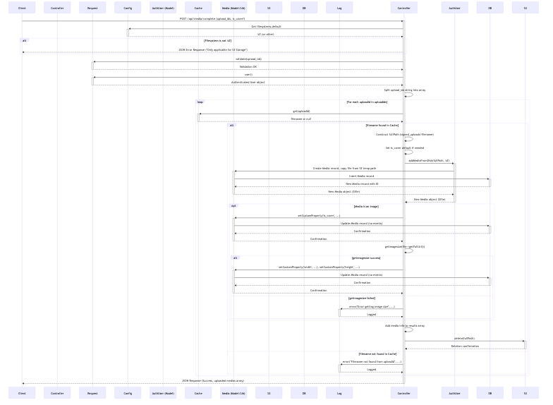

# Media Management Module

The Media Management module handles the uploading, processing, and serving of media files (images and videos) within the FunHub Mobile Backend. This module provides a secure and efficient mechanism for users to upload media files and associate them with articles and other content.

## User Stories

| As a | I want to | Acceptance Criteria |
|------|-----------|---------------------|
| User | Upload images for my articles | - I can upload images securely - I can see the upload progress - I can receive confirmation when uploads complete - I can use the uploaded images in my articles |
| User | Upload videos for my articles | - I can upload videos securely - I can see the upload progress - I can receive confirmation when uploads complete - I can use the uploaded videos in my articles |
| User | Associate uploaded media with my articles | - I can select previously uploaded media for my articles - I can remove media from my articles - I can set an image as the cover for my article |
| Developer | Implement secure direct-to-S3 uploads | - The system generates secure signed URLs - Users can upload directly to S3 without exposing credentials - The system validates and processes uploads after completion |
| User | View media in different client environments | - Media URLs work correctly across all devices and browsers - Special characters in filenames are handled properly - Media loads efficiently through CDN |

## Key Methods and Logic Flow

### `getSignedUploadLink()`
Generates a secure, temporary URL for uploading media directly to S3 storage.

**Implementation Details:**
- Validates the filename to ensure it contains only allowed characters (alphanumeric, hyphens, underscores, periods)
- Generates a unique filename with timestamp and random string to prevent collisions
- Creates a temporary upload ID and stores it in the cache with the filename (60-minute expiration)
- Uses AWS S3's `temporaryUploadUrl()` method to generate a signed URL with a 20-minute expiration
- Returns the upload ID and signed URL to the client for direct upload
- Includes error handling for non-S3 storage configurations

### `postUploadMediaComplete()`
Completes the media upload process after the client has uploaded to the signed URL.

**Implementation Details:**
- Validates the upload IDs provided by the client
- Retrieves filenames from cache using the upload IDs
- For each valid upload ID:
  - Moves the file from the temporary `signed_uploads` collection to the user's `user_uploads` collection
  - Processes image files:
    - Sets custom properties like dimensions and cover status
    - Extracts and stores image dimensions for responsive display
  - Prepares video files for processing
  - Builds response with media information (ID, URL, size, type)
- Cleans up by removing temporary files from S3
- Handles error cases with appropriate logging and client feedback

### `ArticleController::store()` (Media Integration)
Integrates with the Media Management module to associate uploaded media with new articles.

**Implementation Details:**
- Creates a new article record with basic information
- Processes image attachments:
  - Retrieves the user's uploaded media using the provided media IDs
  - Moves media from the user's `user_uploads` collection to the article's gallery collection
  - Maintains custom properties like cover status
- Processes video attachments:
  - Moves video from user's temporary collection to the article's collection
  - Dispatches the `ByteplusVODProcess` job for video processing
  - Sets up video metadata for streaming
- Ensures proper association between media and the article

### `ArticleController::update()` (Media Integration)
Handles updating media associations when articles are modified.

**Implementation Details:**
- Verifies the user is the owner of the article
- Processes changes to image attachments:
  - Adds new images from the user's uploads
  - Removes images that are no longer associated
  - Updates cover image status if changed
- Processes changes to video attachments:
  - Replaces existing video with new one if provided
  - Triggers video processing for new videos
- Maintains proper media associations through the update process

### `MediaResource::toArray()`
Transforms media objects into API responses with proper URL encoding.

**Implementation Details:**
- Formats basic media information (name, file name, UUID, URL, size, etc.)
- Handles CloudFront URL encoding:
  - Detects if the URL contains "cloudfront"
  - Splits the URL by "/" separator
  - URL-encodes the filename portion (last segment)
  - Rejoins the URL parts to create a properly encoded URL
- Includes video-specific information for video media:
  - Available resolutions and formats
  - Adaptive bitrate streaming URLs
  - Processing status
- Returns a structured response for client consumption

## Security Considerations

- **Temporary Signed URLs**: URLs expire after 20 minutes, limiting the window for potential misuse
- **Filename Validation**: Only alphanumeric characters, hyphens, underscores, and periods are allowed in filenames
- **User Authentication**: All media upload endpoints require user authentication
- **Media Ownership**: Media is associated with the authenticated user and can only be used in their articles
- **Direct-to-S3 Upload**: Prevents exposing AWS credentials to clients while enabling efficient uploads
- **Content Validation**: File types and sizes are validated before processing
- **Secure URL Generation**: Uses AWS SDK's secure methods for generating signed URLs

## Performance Considerations

- **Direct-to-S3 Uploads**: Reduces server load by having clients upload directly to S3
- **CloudFront CDN Integration**: Serves media through CDN for faster delivery and reduced origin load
- **Asynchronous Video Processing**: Handles video processing in background jobs to prevent blocking requests
- **Efficient Media Movement**: Uses Spatie Media Library's optimized methods for moving media between collections
- **Cached Upload IDs**: Stores upload information in cache to reduce database load during the upload process
- **Optimized URL Encoding**: Only encodes CloudFront URLs when necessary
- **Selective Media Loading**: Loads media with appropriate relationships based on context
- **Custom Properties**: Stores media dimensions and other metadata to avoid recalculation
