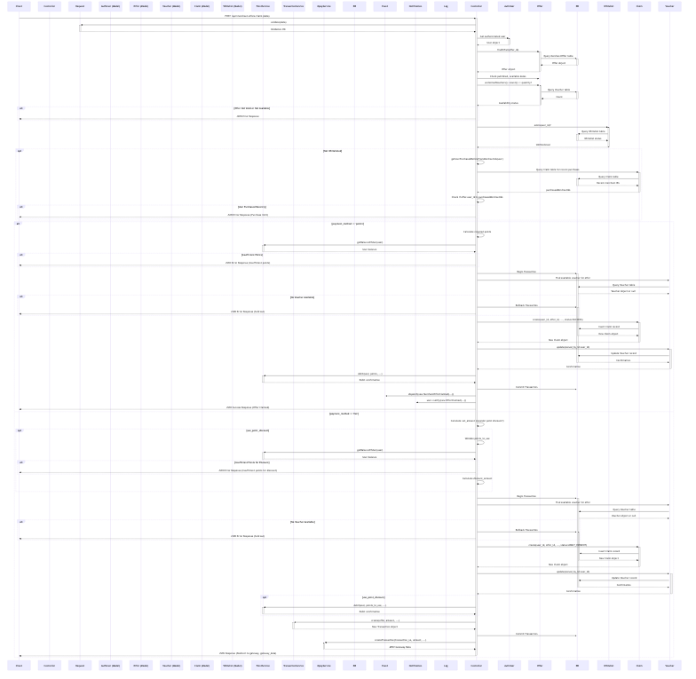

# Merchant Offer Module

The Merchant Offer module is a key component of the FunHub Mobile Backend, providing functionality for merchants to create offers that users can claim and redeem. This module enables users to discover, claim, and redeem offers from various merchants, while allowing merchants to manage their promotions effectively.

## User Stories

| As a | I want to | Acceptance Criteria |
|------|-----------|---------------------|
| User | Discover merchant offers | - I can view available offers - I can filter offers by category - I can filter offers by location - I can filter offers by merchant - I can find offers near my location - I can see flash deals and time-limited offers |
| User | Claim merchant offers | - I can claim offers using points or fiat currency - I can see the price and any point discounts - I can choose my payment method - I can receive confirmation of my claim - I can see my claimed offers |
| User | Redeem claimed offers | - I can view my claimed offers - I can redeem offers in-store - I can see redemption status - I can see expiration dates - I can receive confirmation of redemption |
| Merchant | Create and manage offers | - I can create offers with details and pricing - I can set availability dates - I can limit quantities - I can associate offers with specific stores - I can set expiration periods - I can create flash deals |

## Key Methods and Logic Flow

### `index()`
The main method for retrieving merchant offers with extensive filtering options.

**Implementation Details:**
- Constructs a query to fetch published merchant offers
- Applies numerous filters based on request parameters:
  - Category filtering to show offers in specific categories
  - Merchant offer ID filtering to retrieve specific offers
  - City and state filtering for location-based offers
  - Availability filtering (available only, coming soon, not expired)
  - Flash deal filtering for time-sensitive offers
  - Merchant and store filtering
  - Location-based filtering with radius search
- Uses eager loading to preload related data (user, merchant, claims, categories, stores, locations)
- Processes point discount information for offers:
  - Calculates available points for discount based on user's balance
  - Determines maximum points that can be used for each offer
  - Computes discounted price after applying points
- Tracks user purchase history to enforce merchant spending limits
- Returns a paginated collection of merchant offers with all relevant relationships

### `getMyMerchantOffers()`
Retrieves offers that the authenticated user has claimed.

**Implementation Details:**
- Builds a query to find successful claims made by the user
- Applies filters based on request parameters:
  - Redeemed status filtering to show redeemed or unredeemed offers
  - Expiration status filtering to show expired or valid offers
  - Claim ID filtering to retrieve a specific claim
- Uses eager loading to preload related offer data (merchant, stores, categories)
- Calculates expiration dates based on claim date and offer expiry days
- Returns a collection of claimed offers with redemption status and expiration information

### `show()`
Retrieves detailed information about a specific merchant offer.

**Implementation Details:**
- Finds the offer by ID and validates its existence
- Loads all related data including merchant, stores, categories, and media
- Checks if the user has previously interacted with the offer
- Calculates point discount information if applicable
- Records a view interaction for analytics
- Returns comprehensive offer details with all relationships

### `postClaimOffer()`
Handles the claiming of merchant offers by users.

**Implementation Details:**
- Validates input data for required fields (offer ID, quantity, payment method)
- Retrieves the offer and validates its availability
- Checks user eligibility to claim the offer:
  - Verifies offer is within available dates
  - Ensures sufficient quantity is available
  - Checks user hasn't exceeded merchant spending limits
- Processes payment based on the selected payment method:
  - Points payment with balance verification
  - Fiat payment with gateway integration (FPX, card)
  - Point discount calculations when applicable
- Creates claim records and generates vouchers
- Updates inventory counts
- Records transaction details
- Sends notifications to user and merchant
- Returns confirmation or payment gateway information

### `postRedeemOffer()`
Manages the redemption of claimed offers in-store.

**Implementation Details:**
- Validates input data including redemption code
- Verifies the claim exists and belongs to the user
- Checks if the offer has already been redeemed
- Validates the redemption code against the merchant's code
- Creates redemption records with timestamp and location
- Updates claim status to redeemed
- Sends redemption notifications to user and merchant
- Records analytics data for merchant reporting
- Returns confirmation with updated offer information

### `getPublicOffers()`
Provides a public-facing API for retrieving offer information.

**Implementation Details:**
- Similar to index() but with limited information for public access
- Applies filters for categories, location, and availability
- Returns only essential offer information suitable for public display
- Excludes sensitive merchant and pricing details
- Optimized for performance with minimal data loading

### `getMerchantOffersNearby()`
Specialized method for location-based offer discovery.

**Implementation Details:**
- Requires latitude and longitude parameters
- Uses spatial queries to find offers within a specified radius
- Calculates distance and sorts results by proximity
- Applies additional filters (categories, availability)
- Optimizes query performance with selective loading
- Returns offers with distance information included

### `getLastPurchaseDateFromMerchantUser()`
Retrieves the user's last purchase information from a specific merchant.

**Implementation Details:**
- Accepts merchant user ID parameter
- Queries successful claims to find the most recent purchase
- Returns the last purchase date and offer ID
- Used for enforcing merchant spending limits and personalization

### `getOfferQuantityPurchasedByUser()`
Retrieves statistics about a user's offer purchase history.

**Implementation Details:**
- Accepts date range and status filters
- Calculates total quantity of offers purchased by the user
- Aggregates data across multiple claims
- Returns summary statistics for user purchase history

## Security Considerations
- Authorization checks ensure only legitimate users can claim offers
- Validation of redemption codes prevents fraudulent redemptions
- Transaction records maintain audit trail for all claims
- Rate limiting prevents abuse of claiming and redemption systems
- Merchant spending limits prevent excessive purchases from same merchant
- Payment processing includes verification and security measures
- Whitelist functionality for special users with exemptions from limits

## Claim and Redemption Process

The claim and redemption process is a critical workflow in the Merchant Offer module, involving multiple models and controllers working together to provide a seamless experience for users.

### Claim Process Flow

1. **User Initiates Claim**
   - User selects an offer and initiates the claim process via the `postClaimOffer()` method
   - System validates the request parameters (offer_id, quantity, payment_method)
   - System checks if the offer is still valid (within available dates and not expired)

2. **Availability Verification**
   - System verifies that sufficient unclaimed vouchers exist for the requested quantity
   - If insufficient vouchers are available, the claim is rejected with a "sold out" message

3. **User Eligibility Check**
   - System checks if the user has previously purchased from the same merchant within the restricted time period
   - This is done via the `getUserPurchasedBeforeFromMerchantIds()` method which enforces business rules about repeat purchases
   - If the user is ineligible due to previous purchases, the claim is rejected

4. **Payment Processing**
   - For **Points Payment**:
     - System verifies user has sufficient point balance via the PointService
     - If sufficient, points are debited from the user's account
     - A claim record is created with status `CLAIM_SUCCESS`
     - The voucher is immediately assigned to the user
   
   - For **Fiat Payment** (FPX, card, wallet):
     - System creates a payment transaction record
     - System integrates with the payment gateway (e.g., MPay)
     - A claim record is created with status `CLAIM_AWAIT_PAYMENT`
     - The voucher is temporarily locked for the user
     - User is redirected to the payment gateway
     - Upon successful payment callback, the claim status is updated to `CLAIM_SUCCESS`
     - If payment fails, the voucher is released and claim status is set to `CLAIM_FAILED`

5. **Inventory Update**
   - System decrements the offer quantity by the claimed amount
   - This ensures accurate inventory tracking and prevents overselling

6. **Notification**
   - System sends a notification to the user confirming the successful claim
   - For points payment, this happens immediately
   - For fiat payment, this happens after successful payment confirmation

### Redemption Process Flow

1. **User Initiates Redemption**
   - User visits the merchant store and initiates redemption via the `postRedeemOffer()` method
   - System validates the request parameters (claim_id, offer_id, quantity, redeem_code)

2. **Claim Verification**
   - System verifies that the user has a valid claim for the specified offer
   - System checks if the claim status is `CLAIM_SUCCESS`
   - System verifies that the claim has not been fully redeemed already

3. **Expiration Check**
   - If the offer has an expiry period, system checks if the claim is still valid:
     - Calculates expiry date as `claim_created_at + offer_expiry_days`
     - If current date is past the expiry date, redemption is rejected

4. **Merchant Verification**
   - System validates the merchant's redemption code provided by the user
   - This code is matched against the merchant's stored code to authorize the redemption
   - If the code doesn't match, redemption is rejected

5. **Redemption Record Creation**
   - System creates a redemption record via the `MerchantOfferClaimRedemptions` model
   - Links the redemption to the user, offer, and claim
   - Records the quantity redeemed and timestamp

6. **Notification**
   - System sends notifications to both the user and merchant confirming the redemption
   - User notification includes offer details and redemption confirmation
   - Merchant notification includes user information and offer details

### Key Models Involved

1. **MerchantOffer**
   - Represents the offer created by merchants
   - Contains details like price, availability dates, quantity, and expiry period
   - Has relationships with merchants, stores, categories, and claims
   - Manages voucher inventory and availability

2. **MerchantOfferClaim**
   - Represents a user's claim on an offer
   - Tracks claim status (success, failed, awaiting payment)
   - Contains purchase details (quantity, price, payment method)
   - Links to transaction records for fiat payments
   - Has relationship with the voucher assigned to the user

3. **MerchantOfferClaimRedemptions**
   - Represents the redemption of a claimed offer
   - Records when and how much of a claim was redeemed
   - Maintains the relationship between user, claim, and offer
   - Enables partial redemptions of multi-quantity claims

4. **User**
   - Contains user information and relationships
   - Includes methods for checking purchase history and eligibility
   - Manages point balance for point-based transactions
   - Receives notifications about claims and redemptions

### Business Rules and Restrictions

1. **Purchase Frequency Limits**
   - Users may be restricted from purchasing offers from the same merchant within a configurable time period
   - This is enforced via the `getUserPurchasedBeforeFromMerchantIds()` method
   - The restriction period is configured via `config('app.same_merchant_spend_limit_days')`

2. **Expiration Rules**
   - Offers can have an expiry period defined in days
   - The expiry is calculated from the claim date, not the offer creation date
   - Expired claims cannot be redeemed

3. **Redemption Authorization**
   - Only merchants with the correct redemption code can authorize redemptions
   - This prevents unauthorized redemptions and fraud

4. **Quantity Management**
   - Users can only redeem up to the quantity they have claimed
   - System prevents redemption of more items than claimed
   - Partial redemptions are supported for multi-quantity claims

## Performance Considerations
- Eager loading relationships to prevent N+1 query issues
- Selective field retrieval to minimize data transfer
- Caching of frequently accessed data (e.g., user point balances)
- Background processing for inventory updates
- Pagination to limit result sets
- Optimized queries for location-based searches
- Transaction isolation to prevent race conditions during claims
- Indexing of offers for efficient search operations
