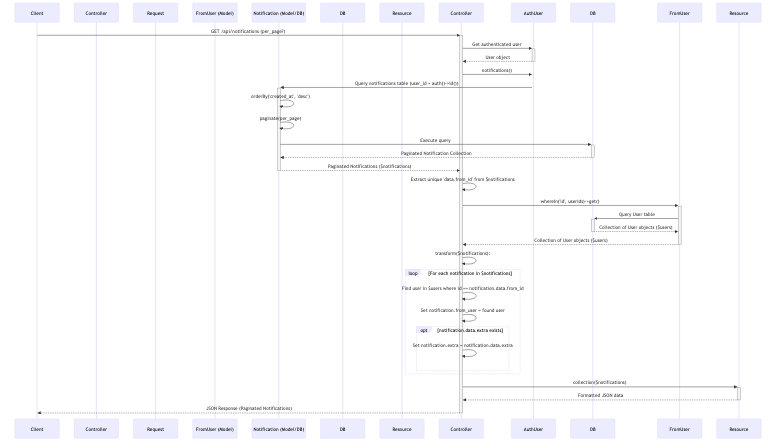

# Notification Module

The Notification module is a core component of the FunHub Mobile Backend, providing functionality for managing and delivering notifications to users across multiple channels. This module enables users to receive real-time updates about various activities and events within the application, such as mission completions, reward disbursements, and user interactions.

## User Stories

| As a | I want to | Acceptance Criteria |
|------|-----------|---------------------|
| User | Receive notifications about important events | - I receive notifications when missions are started<br>- I receive notifications when missions are completed<br>- I receive notifications when rewards are disbursed<br>- I receive notifications about user interactions (comments, likes, etc.)<br>- Notifications include relevant details about the event |
| User | View all my notifications | - I can see a list of all my notifications<br>- Notifications are displayed in chronological order (newest first)<br>- I can see which notifications are unread<br>- I can see notification details including sender, timestamp, and message |
| User | Mark notifications as read | - I can mark all notifications as read at once<br>- I can mark individual notifications as read<br>- Read notifications are visually distinguished from unread ones |
| User | Manage notification preferences | - I can enable/disable specific notification types<br>- I can choose notification delivery channels (in-app, push, email)<br>- My notification preferences are saved and applied consistently |
| Administrator | Send system notifications to users | - I can send notifications to specific users or user groups<br>- I can create notifications with custom content<br>- I can track notification delivery status |

## Key Methods and Logic Flow

### `getNotifications()`


The main method for retrieving a user's notifications with pagination.
**Implementation Details:**
- Retrieves the authenticated user's notifications from the database
- Orders notifications by creation date in descending order (newest first)
- Paginates results based on the specified per_page parameter or default value
- Efficiently loads user data for notification senders in a single query
- Transforms notification data to include sender information and any extra attributes
- Returns notifications as a collection of NotificationResource objects

```php
public function getNotifications(Request $request)
{
    // get user database notifications
    $notifications = auth()->user()->notifications()
    ->orderBy('created_at', 'desc')
    ->paginate(
        $request->input('per_page', config('app.paginate_per_page')),
    );

    // get all user ids from current load
    $userIds = $notifications->pluck('data.from_id')->unique();

    // load users
    $users = User::whereIn('id', $userIds)->get();

    // map UserResource of $users into the $notifications results
    $notifications->getCollection()->transform(function ($notification) use ($users) {
        $notification->from_user = $users->where('id', $notification->data['from_id'])->first();

        // appends extra attribute if present
        if (isset($notification->data['extra'])) {
            $notification->extra = $notification->data['extra'];
        }
        return $notification;
    });

    return NotificationResource::collection($notifications);
}
```

### `postMarkUnreadNotificationAsRead()`
Marks all unread notifications for the authenticated user as read.

**Implementation Details:**
- Retrieves all unread notifications for the authenticated user
- Iterates through each unread notification and marks it as read
- Returns a success message to confirm the action

```php
public function postMarkUnreadNotificationAsRead()
{
    $user = auth()->user();

    foreach ($user->unreadNotifications as $notification) {
        $notification->markAsRead();
    }

    return response()->json([
        'message' => __('messages.success.notification_controller.Notifications_marked_as_read')
    ]);
}
```

### `postMarkSingleUnreadNotificationAsRead()`
Marks a specific notification as read based on its ID.

**Implementation Details:**
- Validates the notification ID from the request
- Retrieves the specific notification for the authenticated user
- Checks if the notification exists and returns an error if not found
- Marks the notification as read
- Returns a success message to confirm the action

```php
public function postMarkSingleUnreadNotificationAsRead(Request $request)
{
    $this->validate($request, [
        'notification_id' => 'required',
    ]);

    $user = auth()->user();

    // get notification by notification id
    $notification = $user->notifications()->where('id', $request->notification_id)->first();
    if (!$notification) {
        return response()->json([
            'message' => __('messages.error.notification_controller.Notification_not_found')
        ], 404);
    } else {
        $notification->markAsRead();
    }

    return response()->json([
        'message' => __('messages.success.notification_controller.Notifications_marked_as_read')
    ]);
}
```

## Notification Types and Channels

The Notification module supports multiple notification types and delivery channels:

### Channels
1. **Database** - Stores notifications in the database for retrieval in the app
2. **FCM (Firebase Cloud Messaging)** - Delivers push notifications to mobile devices
3. **Email** - Sends email notifications for important events (optional)

### Complete List of Notifications

| Notification Name | Channels | File | Description |
|-------------------|----------|------|-------------|
| ArticleInteracted | FCM, Database | ArticleInteracted.php | Sent when a user interacts with an article (like, share, etc.) |
| CommentLiked | FCM, Database | CommentLiked.php | Sent when a user likes another user's comment |
| CommentReplied | FCM, Database | CommentReplied.php | Sent when a user replies to another user's comment |
| Commented | FCM, Database | Commented.php | Sent when a user comments on content |
| CompletedNewbieMission | FCM, Database | CompletedNewbieMission.php | Sent when a new user completes their first mission |
| CustomNotification | FCM, Database | CustomNotification.php | Generic notification that can be customized for various purposes |
| MerchantOnboardEmail | Email | MerchantOnboardEmail.php | Email notification sent during merchant onboarding process |
| MissionCompleted | FCM, Database | MissionCompleted.php | Sent when a user completes a mission |
| MissionStarted | FCM, Database | MissionStarted.php | Sent when a user starts a new mission |
| NewFollowRequest | FCM, Database | NewFollowRequest.php | Sent when a user receives a follow request |
| NewFunboxRewardApproved | FCM, Database | NewFunboxRewardApproved.php | Sent when a Funbox reward is approved |
| NewMerchantOfferListed | FCM, Database | NewMerchantOfferListed.php | Sent when a new merchant offer is listed |
| NewSupportRequestMessage | FCM, Database | NewSupportRequestMessage.php | Sent when there's a new message in a support request |
| NewSupportRequestRaised | FCM, Database | NewSupportRequestRaised.php | Sent when a new support request is created |
| Newfollower | FCM, Database | Newfollower.php | Sent when a user gains a new follower |
| OfferClaimed | FCM, Database | OfferClaimed.php | Sent when a user claims an offer |
| OfferRedeemed | FCM, Database | OfferRedeemed.php | Sent when a user redeems an offer |
| PurchasedGiftCardNotification | FCM, Database | PurchasedGiftCardNotification.php | Sent when a user purchases a gift card |
| PurchasedOfferNotification | FCM, Database | PurchasedOfferNotification.php | Sent when a user purchases an offer |
| RedeemReview | FCM, Database | RedeemReview.php | Sent when a redemption is reviewed |
| RedemptionExpirationNotification | FCM, Database | RedemptionExpirationNotification.php | Sent when a redemption is about to expire |
| ReferralRewardReceivedNotification | FCM, Database | ReferralRewardReceivedNotification.php | Sent when a user receives a referral reward |
| RepliedCommentReplies | FCM, Database | RepliedCommentReplies.php | Sent when a user replies to a comment reply |
| RewardReceivedNotification | FCM, Database | RewardReceivedNotification.php | Sent when a user receives a reward |
| TaggedUserInArticle | FCM, Database | TaggedUserInArticle.php | Sent when a user is tagged in an article |
| TaggedUserInComment | FCM, Database | TaggedUserInComment.php | Sent when a user is tagged in a comment |
| VoucherRedeemedNotification | FCM, Database | VoucherRedeemedNotification.php | Sent when a voucher is redeemed |

### Common Notification Types

1. **Mission-related Notifications**
   - Mission Started
   - Mission Completed
   - Reward Received

2. **User Interaction Notifications**
   - Comment on Article
   - Like on Article
   - User Follow

3. **Transaction Notifications**
   - Payment Confirmation
   - Offer Claimed

## Examples of Notifications from MissionService

The MissionService sends several types of notifications at different stages of the mission lifecycle:

### 1. Mission Started Notification

Sent when a user starts a new mission or a new mission instance is created.

```php
private function sendMissionStartedNotification(Mission $mission, User $user): void 
{
    try {
        $locale = $user->last_lang ?? config('app.locale');
        $user->notify((new \App\Notifications\MissionStarted(
            $mission,
            $user,
            1,
            json_encode($mission->events)
        ))->locale($locale));
    } catch (\Exception $e) {
        Log::error('Failed to send mission started notification', [
            'mission_id' => $mission->id,
            'user_id' => $user->id,
            'error' => $e->getMessage()
        ]);
    }
}
```

### 2. Mission Completed Notification

Sent when a user completes a mission. This notification includes information about the mission and the reward.

```php
private function sendMissionCompletedNotification(Mission $mission, User $user): void 
{
    try {
        $user->notify(new MissionCompleted(
            $mission,
            $user,
            $mission->missionable->name,
            $mission->reward_quantity
        ));
        
        // dispatch event for mission completion
        event(new MissionCompletedEvent($mission, $user));
    } catch (\Exception $e) {
        Log::error('Failed to send mission completed notification', [
            'mission_id' => $mission->id,
            'user_id' => $user->id,
            'error' => $e->getMessage()
        ]);
    }
}
```

### 3. Reward Received Notification

Sent when a reward is disbursed to a user after completing a mission. This is particularly important for missions with manual reward claiming.

```php
private function sendRewardReceivedNotification(Mission $mission, User $user, MissionRewardDisbursement $disbursement): void
{
    try {
        $this->currentUser->notify(new RewardReceivedNotification(
            $mission->missionable,
            $disbursement->reward_quantity,
            $this->currentUser,
            $mission->name,
            $mission
        ));
    } catch (\Exception $e) {
        Log::error('Failed to send reward received notification', [
            'mission_id' => $mission->id,
            'user_id' => $user->id,
            'disbursement_id' => $disbursement->id,
            'error' => $e->getMessage()
        ]);
    }
}
```

## Notification Content Structure

Notifications in the system follow a consistent structure to ensure proper display and handling:

### Database Notification Structure

```php
[
    'object' => get_class($this->mission),         // Class of the related object
    'object_id' => $this->mission->id,             // ID of the related object
    'link_to_url' => false,                        // Whether to link to a URL
    'link_to' => $this->mission->id,               // ID to link to
    'link_to_object' => null,                      // Object to link to
    'action' => 'mission_completed',               // Action type
    'from_name' => $this->user->name,              // Sender name
    'from_id' => $this->user->id,                  // Sender ID
    'title' => $completedTitle,                    // Notification title
    'message' => $this->getMessage(),              // Notification message
    'extra' => [                                   // Additional data
        'complete_mission_image_en_url' => $imageUrl,
        'frequency' => $this->mission->frequency,
        'auto_disburse_rewards' => $autoDisburse,
        'reward_image_url' => $rewardImage
    ]
]
```

### FCM Notification Structure

```php
FcmMessage::create()
    ->setData([
        'object' => (string) get_class($this->reward),
        'object_id' => (string) $this->reward->id,
        'link_to_url' => (string) 'false',
        'link_to' => (string) $this->reward->id,
        'link_to_object' => (string) 'false',
        'action' => 'mission_rewarded',
        'from_name' => 'Funhub',
        'from_id' => '',
        'title' => (string) $this->user->name,
        'message' => $messageText
    ])
    ->setNotification(\NotificationChannels\Fcm\Resources\Notification::create()
        ->setTitle($notificationTitle)
        ->setBody($messageText)
    )
```

## Security Considerations

1. **Authentication Verification**: All notification endpoints verify that the user is authenticated before allowing access to notifications.
   ```php
   $user = auth()->user();
   ```

2. **Notification Ownership**: Users can only access and manage their own notifications.
   ```php
   $notification = $user->notifications()->where('id', $request->notification_id)->first();
   ```

3. **Input Validation**: All input parameters are validated before processing.
   ```php
   $this->validate($request, [
       'notification_id' => 'required',
   ]);
   ```

4. **Error Handling**: Comprehensive error handling is implemented to prevent exposure of sensitive information.
   ```php
   try {
       // Notification sending logic
   } catch (\Exception $e) {
       Log::error('Failed to send notification', [
           'error' => $e->getMessage()
       ]);
   }
   ```

## Performance Considerations

1. **Efficient User Loading**: When retrieving notifications, user data is loaded efficiently in a single query rather than making separate queries for each notification.
   ```php
   $userIds = $notifications->pluck('data.from_id')->unique();
   $users = User::whereIn('id', $userIds)->get();
   ```

2. **Pagination**: Notifications are paginated to avoid loading too many records at once, improving performance for users with many notifications.
   ```php
   ->paginate($request->input('per_page', config('app.paginate_per_page')))
   ```

3. **Queueable Notifications**: Notifications that may be resource-intensive are implemented as queueable to prevent blocking the main application thread.
   ```php
   class RewardReceivedNotification extends Notification implements ShouldQueue
   {
       use Queueable;
       // ...
   }
   ```

4. **Batch Processing**: When marking all notifications as read, the operation is performed in a single database transaction to improve efficiency.

5. **Error Resilience**: Notification sending is wrapped in try-catch blocks to ensure that failures in notification delivery don't disrupt core application functionality.
   ```php
   try {
       $user->notify(new MissionCompleted($mission, $user, $reward, $rewardQuantity));
   } catch (\Exception $e) {
       Log::error('Failed to send notification', ['error' => $e->getMessage()]);
   }
   ```

## Integration with Other Modules

1. **Mission Module**: The Notification module integrates with the Mission module to send notifications about mission progress and completion.

2. **User Module**: The Notification module integrates with the User module to retrieve user information and preferences.

3. **Payment Module**: The Notification module integrates with the Payment module to send notifications about transaction status.

4. **Article Module**: The Notification module integrates with the Article module to send notifications about article interactions.

## Conclusion

The Notification module provides a robust system for delivering timely and relevant notifications to users across multiple channels. By supporting various notification types and delivery methods, it ensures that users stay informed about important events and activities within the application. The module's efficient implementation, with features like pagination and batch processing, ensures optimal performance even with large volumes of notifications.
